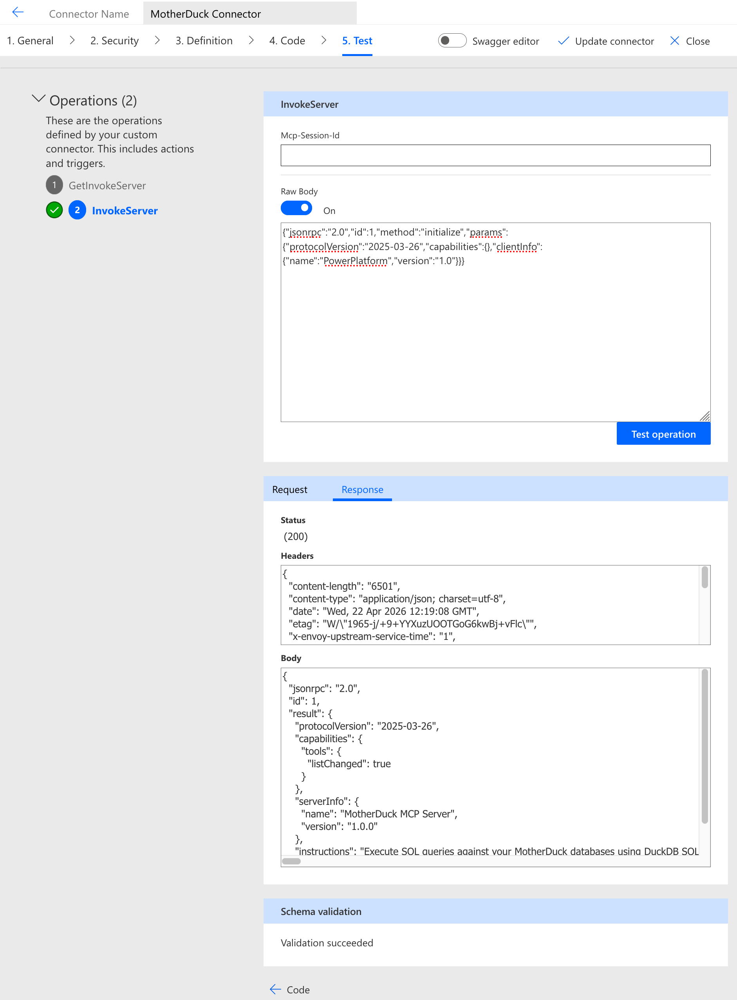
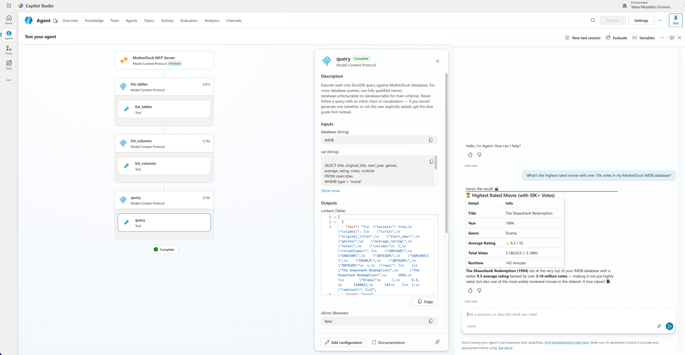
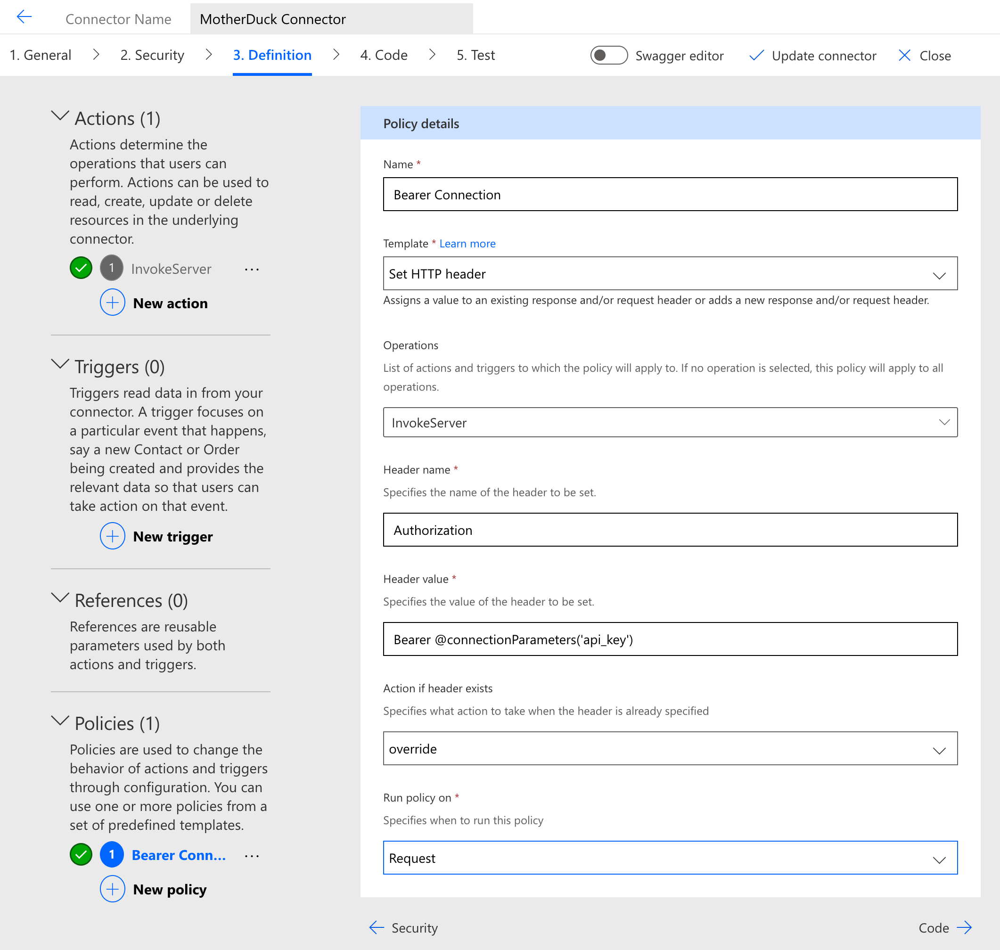

# MotherDuck MCP Connector

[MotherDuck](https://motherduck.com) is a serverless cloud data warehouse built on [DuckDB](https://duckdb.org). This connector exposes the remote MotherDuck MCP server (`https://api.motherduck.com/mcp`) so that Microsoft Copilot Studio agents and Power Automate flows can query MotherDuck with natural language, explore catalogs, and create [Dives](https://motherduck.com/docs/key-tasks/dives/).

The server implements the [Model Context Protocol](https://modelcontextprotocol.io/) Streamable HTTP transport (`x-ms-agentic-protocol: mcp-streamable-1.0`). When imported into Copilot Studio, the connector surfaces MotherDuck's MCP tools (for example `query`, `query_rw`, `list_databases`, `list_tables`, `search_catalog`) to the agent.

## Prerequisites

- A MotherDuck account. [Sign up for free](https://app.motherduck.com).
- A MotherDuck access token. Create one at [Settings → Access Tokens](https://app.motherduck.com/settings/tokens). Use a [read scaling token](https://motherduck.com/docs/key-tasks/authenticating-and-connecting-to-motherduck/read-scaling/) if the agent should be restricted to read-only queries, or a regular access token if the agent needs to modify data.

## Authentication

The connector uses API key authentication. When creating a connection, paste your MotherDuck access token into the **MotherDuck access token** field. The connector sets the `Authorization: Bearer <token>` header on every request to the MCP server — you don't need to add the `Bearer ` prefix yourself.

## Usage

1. Import this connector into your Power Platform environment as a custom connector.
2. Create a connection and supply your Bearer token.
3. Add the connector to a Copilot Studio agent under **Tools → Add a tool**, or reference it from a Power Automate flow.
4. In Copilot Studio, the MotherDuck MCP tools appear in the agent's tool list and can be enabled or disabled individually.

For a full walkthrough of the Copilot Studio setup, see [MotherDuck docs: Connect to the MCP Server](https://motherduck.com/docs/key-tasks/ai-and-motherduck/mcp-setup/).

## Verification

The connector has been deployed and tested end-to-end against the production MotherDuck MCP server.

### Custom Connector UI — Test operation

A `POST /mcp` with a JSON-RPC `initialize` request returns HTTP 200 and the MotherDuck server's capabilities and tool list:

### Copilot Studio — end-to-end agent call

Once the connector is added to a Copilot Studio agent, the MotherDuck MCP tools (`query`, `list_tables`, `list_columns`, and others) appear in the tool list and can be invoked with natural language. For example, asking *"What's the highest rated movie with over 10k votes in my IMDB database?"* runs a SQL query through the `query` tool and returns live data:

### Set Authentication Header policy

The connector prepends the `Bearer ` prefix to the user-supplied token through a `setheader` policy, so users paste only the raw token when creating a connection:

> **Note on the "3 unique operations in a Flow" guidance:** MCP connectors using the `x-ms-agentic-protocol: mcp-streamable-1.0` extension are a single-operation pattern by design — the MCP protocol tunnels all tool calls and session management through one HTTP endpoint. Power Platform auto-expands this into `InvokeServer` (POST) and `GetInvokeServer` (GET for session resumption / SSE). The same shape is used by the existing `custom-connectors/MCP-Streamable-HTTP` and `custom-connectors/MCP-SSE` connectors in this repo and by the certified `DocuSignCopilotMCP` connector.

## Known Issues and Limitations

- All users of the agent share the same MotherDuck token, so queries are attributed to the service account that owns the token rather than the individual end user. If per-user attribution is required, use OAuth 2.0 authentication through [Copilot Studio's native MCP setup](https://motherduck.com/docs/key-tasks/ai-and-motherduck/mcp-setup/) instead of this connector.
- When using a [read scaling token](https://motherduck.com/docs/key-tasks/authenticating-and-connecting-to-motherduck/read-scaling/), `query_rw` still appears in the tool list but write operations are rejected at the server.

For help, see the [MotherDuck documentation](https://motherduck.com/docs/) or contact [MotherDuck support](mailto:support@motherduck.com).
